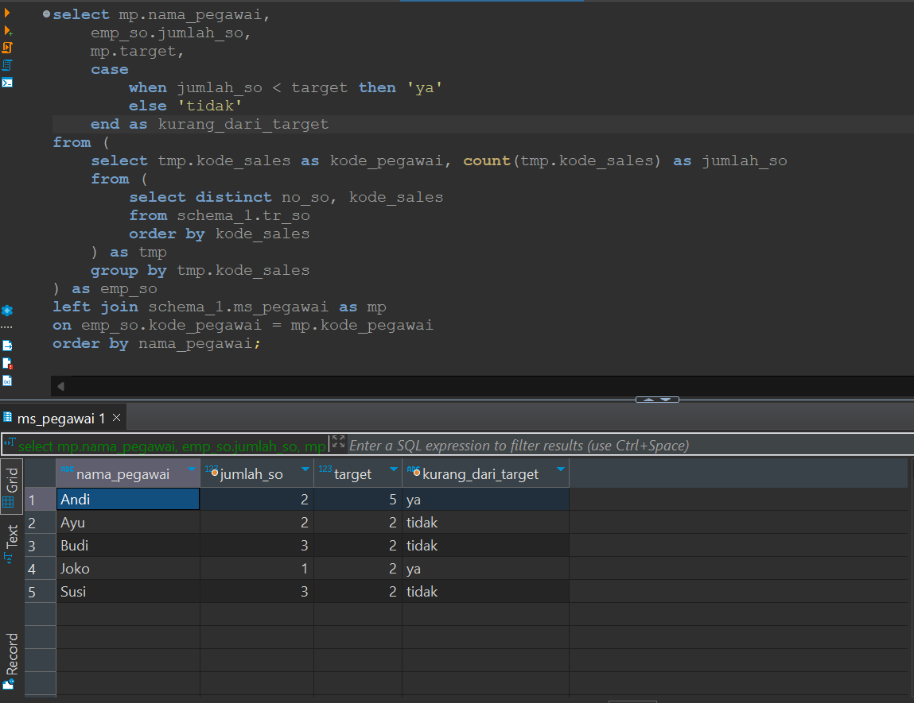

## Question

You are asked to report the sales productivity of each employee from the given table. Sales productivity is assessed based on the number of Sales Operations (SO) performed by each employee compared to their target. One SO number can include multiple items.

**Note:** Sort by *nama_pegawai* in ascending order

**Data Source:** schema_1

