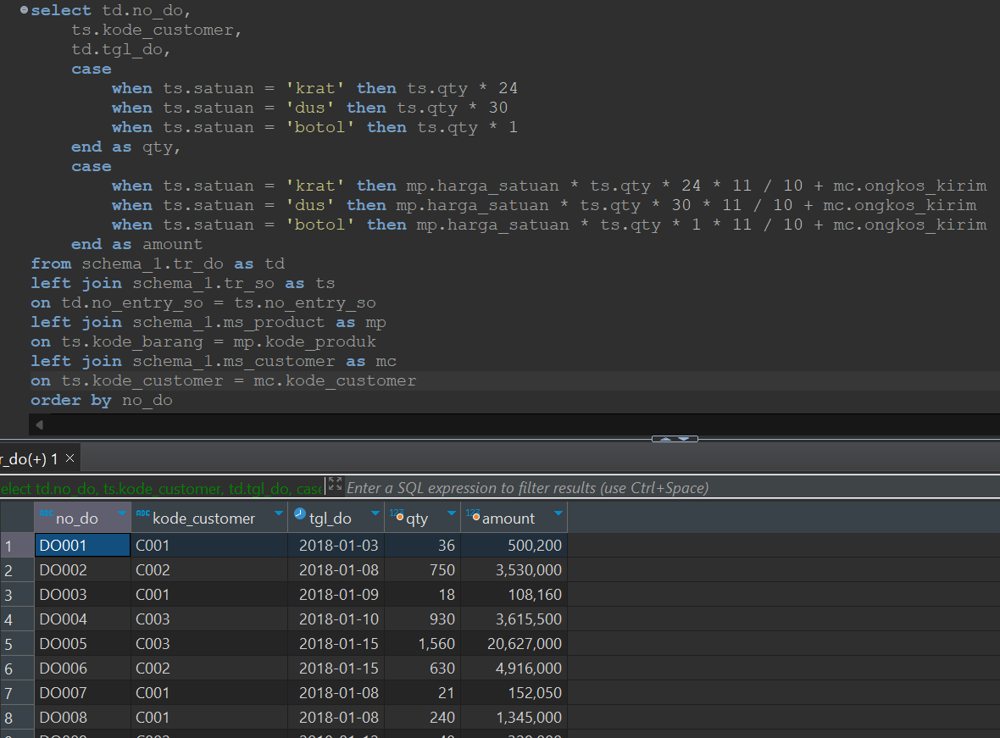

## Question

You are asked to provide a delivery order report. The required table to form the delivery order report is *tr_do* table, and the displayed **amount** value is the **total price of products + tax + shipping cost**.

**Notes:**
- Tax = 10%
- Sort by *no_do* in ascending order

The price of the quantity in the Sales Operations (SO) must be converted first to obtain the unit value, and then multiplied by the unit price of the product.

| **Unit** | **Quantity** |
|----------|--------------|
| Krat     | 24           |
| Dus      | 30           |
| Botol    | 1            |

**Data Source**: schema_1

