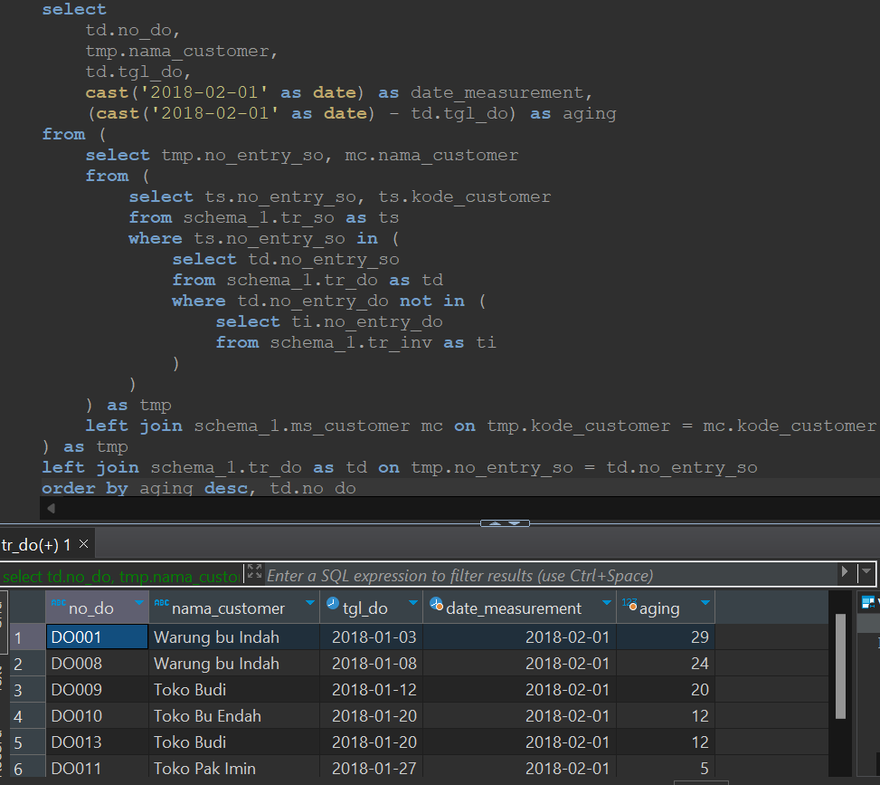

## Question

You are asked to display a report on the age of customer debts. Customer debts are unpaid delivery orders (DO) listed in the Invoice table. Determine the age of debts as of February 1, 2018.

**Note:** Sort by *aging* in descending order and *no_do* in ascending order

Using a query and the *tr_inv* table, create a result as shown below.

**Data Source**: schema_1