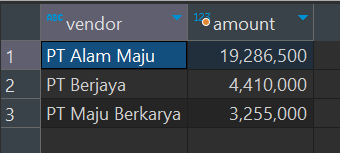

## Question

You are asked to display the top 3 biggest invoice sales done by a vendors.

**Notes:**
- Refer to the unit conversion table in no. 2
- Sort by *amount* in descending order and *vendor* in ascending order
- limit to only 3 rows

Using a query and the *tr_inv* table, create a result as shown below.

**Data Source**: schema_1