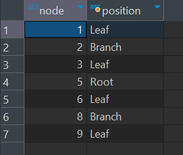

## Question

Check out the *nodes* table in *schema_2* schema:
- If a node does not have a parent, it is a Root.
- If a node has a parent and does not have any children, it is a Leaf.
- If a node has a parent and has children, it is a Branch.

**Note:** Sort by *node* in ascending order

Using a query, create a result as shown below.

**Data Source**: schema_2