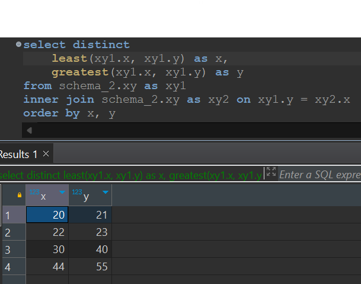

## Question

Check out the *xy* table in *schema_2* schema. Your task is to create a query to search for symmetric pairs. Pairs (X1, Y1) and (X2, Y2) are called symmetric if X1 = Y2 and X2 = Y1, thus, from the input above, it will produce the following output:

Note that 24 and 25 are not symmetric pairs, as well as 88 and 77.

**Note**: Sort by *X* and *Y* in ascending order

**Data Source**: schema_2